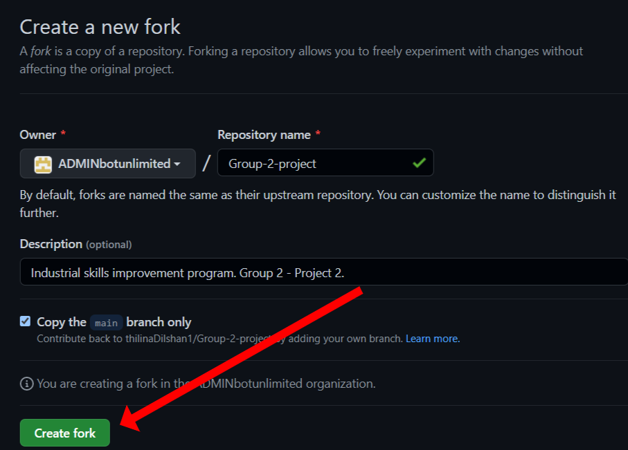

## Click <a href="https://thilinadilshan1.github.io/Group-2-project/">Here</a> to Visit the Site

# Career Guidance Programme Group-2-project

Career guidance program of Faculty of Applied Science, 2022-11-5.

# Instructions for contributors...

## Step 1

Log-in to your GitHub account.  
[Click Here to Sign-in](https://github.com/login)  
(Skip this step if you're already logged-in)

## Step 2

Fork this repository.

1. Click on the Fork button on the top right corner of this page.
   

2. You will be redirected to your forked repository.
   
   Click on create fork button

3. You will be redirected to your forked repository.

4. Now you have a exact copy of the original repository (at the moment you created the fork).  
   You can edit and make changes to any file in the repository.

5. After making changes, you'll need to **commit** the changes you've made.  
   Make sure to add a comprehensive description of the change you made, on the commit description.

6. In this way, you can edit files and commit the changes to _your fork of the repository_.  
   After making enough changes for one feature (or one thing you needed to implement), you can push your code to the original repository.

7. To do that, you'll need to create a **pull request**.  
   To do that, click on **Pull requests** tab of your forked repository and click on **New pull request**.

8. Make sure to describe your new feature well in the pull request description.  
   Then click on **Create pull request**.

9. Now your pull request has been made, and the maintainers of the repository will review your changes and approve or request further changes from you.
